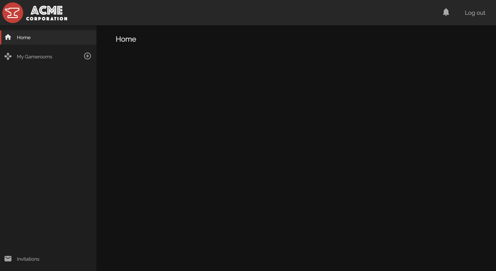
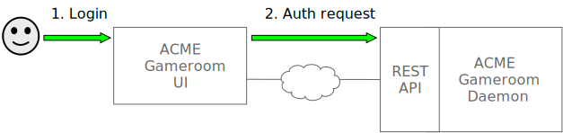
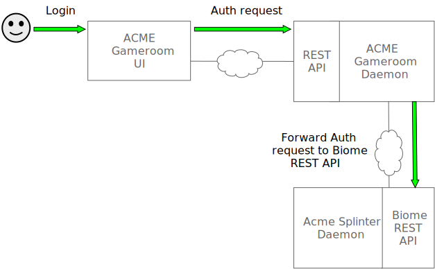
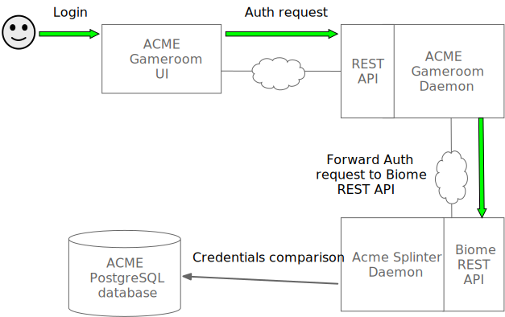
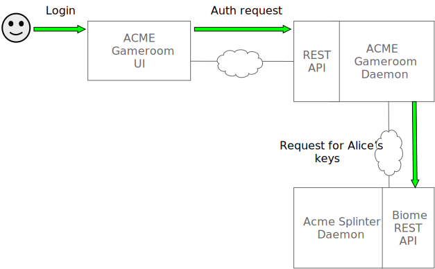
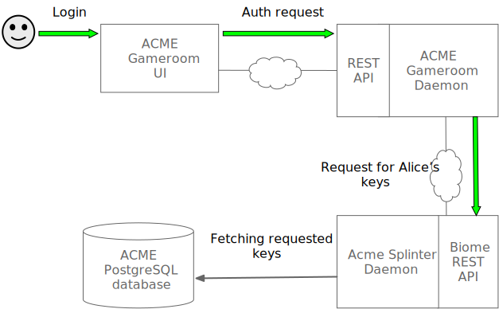

<!--
  Copyright 2018-2020 Cargill Incorporated

  Licensed under the Apache License, Version 2.0 (the "License");
  you may not use this file except in compliance with the License.
  You may obtain a copy of the License at

      http://www.apache.org/licenses/LICENSE-2.0

  Unless required by applicable law or agreed to in writing, software
  distributed under the License is distributed on an "AS IS" BASIS,
  WITHOUT WARRANTIES OR CONDITIONS OF ANY KIND, either express or implied.
  See the License for the specific language governing permissions and
  limitations under the License.
-->

# Gameroom Technical Walkthrough

***NOTE:*** This document is a work in progress! We are updating the
walkthrough with details for Splinter 0.4 and converting it to Markdown. For
a complete version of the document, see the [Gameroom Technical Walkthrough
PDF](https://files.splinter.dev/docs/Gameroom_Walkthrough-Splinter_v0.3.4.pdf).

## Act I: Alice and Bob Create a Gameroom

### Scene 1: Alice logs into Acme's Gameroom application

Alice looks at the GAMEROOM APP LOGIN SCREEN in her browser.


Alice enters her EMAIL and PASSWORD. Clicks LOG IN.

Success. The browser now displays the ACME GAMEROOM HOME SCREEN.



## Behind the Scenes: A Look at Act I, Alice and Bob Create a Gameroom

### I-1. Behind scene 1: Alice logs into Acme's Gameroom UI

Gameroom uses Biome for user management, including authentication. For more
information, check out the [Biome
overview](../../../concepts/biome_user_management.md).

When a user logs in, the user interface (UI) component of the Gameroom client
application works with the Gameroom REST API to check the user's email address
and password and to ensure the user has a public and private key pair. Each
Gameroom client communicates with a Gameroom daemon, using the Gameroom REST API
in order to authenticate a Gameroom user. The Gameroom REST API uses the Biome
REST API to authenticate the user credentials and to fetch key pairs associated
with the user. Biome is a part of the Acme Splinter daemon. Each Splinter daemon
stores the user credentials and keys in a local PostgreSQL database; user
passwords are hashed by the Gameroom client so that they remain secret.

#### I-1.1. Acme UI sends authorization request to Gameroom REST API



When Alice clicks Log in, the Acme Gameroom UI hashes the password, then sends
an authorization request to the Acme Gameroom daemon, gameroomd. The Gameroom
daemon then makes several requests to the Biome REST API to verify the user.

The following request is sent to Acme's Gameroom daemon:

```
POST /users/authenticate
{
  "email": "alice@acme.com",
  "hashedPassword": "8e066d41...d99ada0d"
}
```

The UI does not reveal the user's password to the REST API because the password
is used to encrypt signing keys (as described in section I-2.3, step 5).

#### I-1.2. Gameroom daemon uses Biome REST API to verify password



Once the Gameroom daemon receives the authentication request, the actual
authentication is handled by the Biome REST API. This authentication request
is sent from the Acme Gameroom daemon to the Biome REST API.

```
POST /biome/login
{
  "username": "alice@acme.com",
  "hashed_password": "56ec82cb...480cad32"
}
```

When the Biome REST API receives the authorization request for Alice, it fetches
the entry from the Acme Splinter daemon's local database associated with the
username and verifies the hashed password sent in the request.





The `user_credentials` table in the Splinter database has the following schema:

``` sql
CREATE TABLE IF NOT EXISTS user_credentials (
    id BIGSERIAL PRIMARY KEY,
    user_id TEXT NOT NULL,
    username TEXT NOT NULL,
    password TEXT NOT NULL,
);
```

The Splinter database has the following entry in the `user_credentials` table:

| `user_id` | `username` | `password` |
| :--- | :--- | :--- |
| `06ff2de0...9243ae2cf3` | `alice@acme.com` | `56ec82cb...480cad32` |


If the hashed password from the authentication request passes verification,
the Biome REST API will respond with a success response. This response includes
JSON Web Tokens, which enable the Gameroom REST API to make authorized requests
to the Biome REST API, without requiring the user to enter their password.
The refresh token included in the success response allows a new access token to
be issued, if the refresh token has not expired, when the original token issued
has expired. Each refresh token issued is saved to the `refresh_tokens` table in
the Splinter daemon database, with an associated user ID.

The `refresh_tokens` table in the Splinter database has the following schema:

``` sql
CREATE TABLE IF NOT EXISTS refresh_tokens (
    id BIGSERIAL PRIMARY KEY,
    user_id TEXT NOT NULL,
    token TEXT NOT NULL,
);
```

The Splinter database has the following entry in the `refresh_tokens` table:

| `id` | `user_id` | `token` |
| :--- | :--- | :--- |
| `1` | `06ff2de0...9243ae2cf3` | `zeFgbILi...opBrt4ic` |

If the credentials are verified, the Biome REST API will respond with the
following success response:

``` json
{
  "message": "Successful login",
  "user_id": "06ff2de0...9243ae2cf3",
  "token": "eyJhbGci...adQssw5c",
  "refresh_token": "zeFgbILi...opBrt4ic",
}
```

#### I-1.3. Gameroom daemon uses Biome REST API to request Alice's key pairs



Once the Gameroom daemon has verified Alice's password, it must then verify that
Alice has a public and private key pair. Alice's public and private key pair was
added to the Acme Splinter database during registration (see The Prequel,
section P.2).

The request to list Alice's associated keys is made to the Biome REST API.

```
GET /biome/keys
```

The request to the Biome REST API's keys endpoint holds Alice's
JSON Web Token in an `Authorization` header, which will enable the Splinter
daemon to authorize access to the user's key information, as well as extract the
user ID from the token to fetch the keys from the Splinter daemon's database.





The `keys` table in the Splinter database has the following schema:

``` sql
CREATE TABLE IF NOT EXISTS keys (
    public_key TEXT NOT NULL,
    encrypted_private_key TEXT NOT NULL,
    user_id TEXT NOT NULL,
    display_name TEXT NOT NULL,
    PRIMARY KEY(public_key, user_id)
);
```

Using the unique `user_id` from the access token, the keys associated with Alice
are fetched from the Splinter daemon's database.

The Splinter database has the following entry in the `keys` table:

| `display_name` | `user_id` | `public_key` | `encrypted_private_key` |
| :--- | :--- | :--- | :--- |
|`alice@acme.com`|`06ff2de0...9243ae2cf3`|`0384781f...5a7e4998`|`{\"iv\":...cgXrm\"}`|


If the associated entry is found in the Splinter database `keys` table, a success
response with the list of key information is sent back to the Gameroom daemon.

``` json
{
  "data": [
    {
      "public_key": "0384781f...5a7e4998",
      "user_id": "06ff2de0...9243ae2cf3",
      "display_name": "alice@acme.com",
      "encrypted_private_key": "{\"iv\":\"...cgXrm\"}"
    }
  ]
}
```

#### I-1.4. Gameroom REST API returns login success response

If the Gameroom REST API gets a successful response from both requests sent to
the Biome REST API to verify the user, then the authentication was successful.

The Gameroom REST API sends a response to the Acme UI that contains Alice's
public key and encrypted private key.

``` json
{
  "email": "alice@acme.com",
  "public_key": "0384781f...5a7e4998",
  "encrypted_private_key": "{\"iv\":\"...cgXrm\"}",
}
```

Next, the UI must gather the information for the Acme Gameroom home screen that
Alice will see after logging in.

#### I-1.5. Acme UI requests a list of gamerooms

After a user has been authenticated, the UI gathers user-specific information for
the home screen. First, it requests the list of existing gamerooms for that user.
(At this point, no gamerooms exist.) Later, this walkthrough will describe what
happens when there are gamerooms for the UI to display.

1. When Alice logs in, the Acme UI makes a call to the Gameroom REST API for the
list of gamerooms.

```
GET /api/gamerooms
```

2. This call returns an empty list, since there are no gamerooms in the Acme
Gameroom's PostgreSQL database.

``` json
{
  "data": [],
  "paging": {
    "current": "/gamerooms?limit=100&offset=0",
    "offset": 0,
    "limit": 100,
    "total": 0,
    "first": "/gamerooms?limit=100&offset=0",
    "prev": "/gamerooms?limit=100&offset=0",
    "next": "/gamerooms?limit=100&offset=0",
    "last": "/gamerooms?limit=100&offset=0"
  }
}
```

#### I-1.6. Acme UI requests a list of invitations
Next, the Acme Gameroom UI requests the list of gameroom invitations. In this
scenario, Alice has no invitations, so the list is empty. Later, the walkthrough
will show what happens when a user has unaccepted invitations.

1. When Alice logs in, the UI makes a call to the Gameroom REST API for the list
of invitations (also called _circuit proposals_).

```
GET /api/proposals
```

2. Because Alice has no invitations, the Gameroom REST API returns an empty list.

``` json
{
  "data": [],
  "paging": {
    "current": "/proposals?limit=100&offset=0",
    "offset": 0,
    "limit": 100,
    "total": 0,
    "first": "/proposals?limit=100&offset=0",
    "prev": "/proposals?limit=100&offset=0",
    "next": "/proposals?limit=100&offset=0",
    "last": "/proposals?limit=100&offset=0"
  }
}
```

At this point, Alice sees the Acme Gameroom home screen with no existing
gamerooms or invitations.
