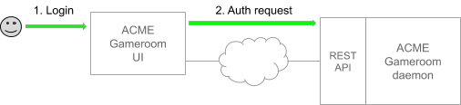
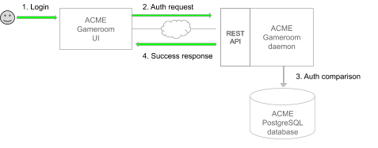

## I-1. Behind scene 1: Alice logs into Acme's Gameroom UI

When a user logs in, the user interface (UI) component of the Gameroom client
application works with the Gameroom REST API to check the user's email address
and password. Each Gameroom daemon stores the user credentials in a local
PostgreSQL database; user passwords are hashed so that they remain secret.

### I-1.1. Acme UI sends authorization request to Gameroom REST API



When Alice clicks Log in, the Acme Gameroom UI hashes the password, then sends
an authorization request to the Acme Gameroom daemon, gameroomd. The request is
handled by the Gameroom REST API, which is a part of gameroomd.

``` json
    POST /users/authenticate
    {
      "email": "alice@acme.com",
      "hashedPassword": "8e066d41...d99ada0d"
    }
```

The UI does not reveal the user's password to the REST API because the password
is used to encrypt signing keys (as described in section I-2.3, step 5).

### I-1.2. Gameroom REST API authorizes login


When the Acme Gameroom REST API receives the authorization request for Alice, it
re-hashes the password sent from the browser and compares the email and hashed
password to Alice’s entry in the Acme Gameroom daemon's local database. If they
match, authentication was successful.

The `gameroom_user` table in the Gameroom database has the following schema:

``` sql
    CREATE TABLE IF NOT EXISTS gameroom_user (
      email TEXT PRIMARY KEY,
      public_key TEXT NOT NULL,
      encrypted_private_key TEXT NOT NULL,
      hashed_password TEXT NOT NULL
    );
```

Alice's public and private key pair was created during registration and was
added to the Acme Gameroom database (see The Prequel, section P.2).
The database has the following entry:

| `email` | `hashed_password` | `public_key` | `encrypted_private_key` |
| :--- | :--- | :--- | :--- |
| `alice@acme.com` | `56ec82cb...480cad32` | `0384781f...5a7e4998` | `{\"iv\":...cgXrm\"}` |

### I-1.3. Gameroom REST API returns login success response



If the user authentication was successful, the Gameroom REST API sends a response
to the Acme UI that contains Alice's public key and encrypted private key.

``` json
    {
      "email": "alice@acme.com",
      "public_key": "0384781f...5a7e4998",
      "encrypted_private_key": "{\"iv\":...cgXrm\"}",
    }
```

Next, the UI must gather the information for the Acme Gameroom home screen that
Alice will see after logging in.

### I-1.4. Acme UI requests a list of gamerooms

After a user has been authenticated, the UI gathers user-specific information for
the home screen. First, it requests the list of existing gamerooms for that user.
(At this point, no gamerooms exist.) Later, this walkthrough will describe what
happens when there are gamerooms for the UI to display.

1. When Alice logs in, the Acme UI makes a call to the Gameroom REST API for the
list of gamerooms.

    `GET /gamerooms`

2. This call returns an empty list, since there are no gamerooms in the Acme
Gameroom's PostgreSQL database.

``` json
    {
      "data": [],
      "paging": {
        "current": "/gamerooms?limit=100&offset=0",
        "offset": 0,
        "limit": 100,
        "total": 0,
        "first": "/gamerooms?limit=100&offset=0",
        "prev": "/gamerooms?limit=100&offset=0",
        "next": "/gamerooms?limit=100&offset=0",
        "last": "/gamerooms?limit=100&offset=0"
      }
    }
```

### I-1.5. Acme UI requests a list of invitations
Next, the Acme Gameroom UI requests the list of gameroom invitations. In this
scenario, Alice has no invitations, so the list is empty. Later, the walkthrough
will show what happens when a user has unaccepted invitations.

1. When Alice logs in, the UI makes a call to the Gameroom REST API for the list
of invitations (also called _circuit proposals_).

    `GET /proposals`

2. Because Alice has no invitations, the Gameroom REST API returns an empty list.

``` json
    {
      "data": [],
      "paging": {
        "current": "/proposals?limit=100&offset=0",
        "offset": 0,
        "limit": 100,
        "total": 0,
        "first": "/proposals?limit=100&offset=0",
        "prev": "/proposals?limit=100&offset=0",
        "next": "/proposals?limit=100&offset=0",
        "last": "/proposals?limit=100&offset=0"
      }
    }
```

At this point, Alice sees the Acme Gameroom home screen with no existing
gamerooms or invitations.
