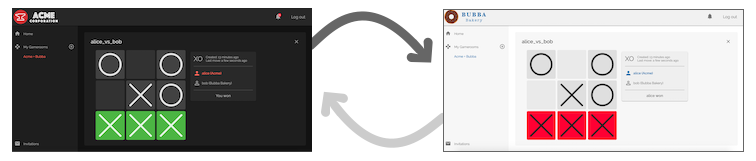

# Splinter Examples

<!--
  Copyright 2018-2020 Cargill Incorporated
  Licensed under Creative Commons Attribution 4.0 International License
  https://creativecommons.org/licenses/by/4.0/
-->

## &nbsp;Gameroom

Gameroom is a full-stack web application that sets up private circuits for two
or three participants to play tic tac toe with shared state.

Although playing distributed games is an unusual use case, Gameroom shows how to
write a Splinter application that integrates the Splinter framework, UI
components, and technologies from several Hyperledger projects. Gameroom
demonstrates the following items:

* **Splinter circuits** for private and secure connections between participants,
  with securely shared state.
* **Splinter Biome** user management, which stores user and credential
  information locally and securely shares it with other systems in the network.
* **Hyperledger Sawtooth Sabre** smart contract engine, which runs WebAssembly
  (WASM) smart contracts. Sabre is included in the Splinter scabbard service.
* **Hyperledger Transact** for executing smart contracts with transactions.
* **Hyperledger Sawtooth's XO smart contract** for the business logic of tic tac
  toe (gameplay rules)

<a href ="/docs/{{ site.data.general.latest_version }}/examples/gameroom/"
type="button" class="btn btn-primary">Try Gameroom ➜</a> &nbsp; 

## &nbsp;Hyperledger&nbsp;Grid

[Hyperledger Grid](https://grid.hyperledger.org/) includes a real-world example
of using Grid as a backend for Splinter. Grid's mission is to provide reference
implementations of supply-chain-centric items – data types, data models,
smart-contract-based business logic, and more – that are anchored on existing
open standards and industry best practices.

This example demonstrates how to combine the Splinter framework with Hyperledger
components into a single, effective business solution. It includes Hyperledger's
Sawtooth Sabre smart contract engine and the Pike, Product, and Schema smart
contracts.

* **Pike** handles organization and identity permissions with Sabre, a smart
  contract engine that is included in the Splinter scabbard service.
* **Product** provides a way to share GS1-compatible product data (items that are
  transacted, traded, or referenced in a supply chain).
* **Schema** provides a reusable, standard approach to defining, storing, and
  consuming the product properties. Property definitions are collected into a
  `Schema` data type that defines all the possible properties for an item.

For more information, see the [Grid
documentation.](https://grid.hyperledger.org/docs/grid/nightly/master/)

<a href ="https://github.com/hyperledger/grid/blob/master/examples/splinter/README.md"
type="button" class="btn btn-primary">Try Grid on Splinter ➜</a> &nbsp; 
